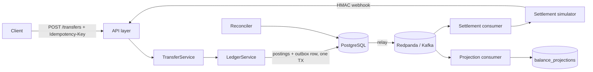

# LedgerFlow

**Auditable event-driven payment ledger with idempotent APIs and replayable state.**

LedgerFlow is a production-style money-movement system built with Java 21 and
Spring Boot. Every transfer is recorded as double-entry postings in PostgreSQL,
published to Kafka via a transactional outbox, settled through a simulated
provider with realistic failure modes, and reconciled against expectations —
with balances maintained as rebuildable projections, never as truth.

## Why this exists

Moving money correctly is one of the hardest problems in backend engineering:
concurrent writes must not lose updates, retried requests must not double-spend,
async settlement must not silently diverge from the ledger, and every cent must
be auditable years later. LedgerFlow implements the patterns real payment
systems use — idempotency keys, transactional outbox, double-entry bookkeeping,
at-least-once consumers, reconciliation — in one coherent, runnable codebase.

## Architecture



**Transaction lifecycle:** transfer → idempotency claim → ledger TX (postings +
outbox, atomic) → relay publishes `ledger.transaction.posted.v1` → settlement
created → simulator behaves per scenario → signed webhook → `settlement.completed.v1`
→ projection folds postings → reconciler verifies.

## Tech stack

Java 21 · Spring Boot 3.2 · PostgreSQL 16 · Redpanda (Kafka API) · Redis ·
Flyway · Spring Security (JWT/RBAC) · OpenTelemetry · Micrometer/Prometheus ·
Testcontainers · k6 · Docker Compose · GitHub Actions

Real-world data: **ECB euro foreign-exchange reference rates**
(`eurofxref-daily.xml`), ingested with full source metadata. Synthetic
transactions are used only for deterministic load/chaos testing.

## Quick start

```bash
cp .env.example .env
docker compose up --build
```

Then follow [docs/runbook.md](docs/runbook.md) — token, accounts, transfer,
failure simulation — in about 5 minutes.

## API examples

```bash
# Idempotent transfer (retry-safe)
curl -X POST localhost:8080/api/v1/transfers \
  -H "Authorization: Bearer $TOKEN" \
  -H "Idempotency-Key: 550e8400-e29b-41d4-a716-446655440000" \
  -H 'Content-Type: application/json' \
  -d '{"sourceAccountId":"…","destAccountId":"…",
       "amountMinorUnits":2500,"currency":"USD",
       "settlementScenario":"SUCCESS"}'
# → 201 {"transactionId":"…","status":"POSTED",…}
# Retry with the same key → 200 + Idempotent-Replay: true, money moves once.

# Compare the three balance sources
curl localhost:8080/api/v1/accounts/$A/balances -H "Authorization: Bearer $TOKEN"
# → cached vs authoritative (postings) vs projected, with consistency flag
```

Full API reference: Swagger UI at `/swagger-ui.html`.

## Core engineering decisions

| Decision | Rationale |
|---|---|
| Double-entry postings, minor-unit `BIGINT` | `debits == credits` is structurally enforced; no float drift (ADR-002) |
| Transactional outbox | postings + event commit atomically; no dual-write loss (ADR-003) |
| At-least-once + idempotent consumers | duplicates are expected and harmless (ADR-004) |
| Optimistic locking on accounts | hot-account correctness without serializing writes (ADR-007) |
| Balances as projections | postings are truth; read models rebuild (ADR-005) |
| Redis for rate limiting only | never holds authoritative state (ADR-008) |
| Modular monolith | one deployable, microservice-ready seams (ADR-009) |
| Settlement simulator | honest failure testing without pretending at real banking (ADR-011) |

All decisions: [docs/adr/](docs/adr/).

## Failure behavior

Every important failure is modeled, not hand-waved — Kafka down, DB restart,
relay crash, consumer killed mid-processing, provider timeout, duplicate
webhooks, projection corruption. Each has a documented outcome and a test.
See [docs/failure-model.md](docs/failure-model.md).

## Observability

Structured JSON logs with correlation IDs · OpenTelemetry traces (Jaeger) ·
Prometheus metrics (`ledgerflow.transfer.duration` p50/p95/p99,
`ledgerflow.outbox.backlog`, open mismatches, HTTP latencies) · Grafana
dashboard provisioned · liveness/readiness probes.

## Testing

`mvn verify` — unit, integration (embedded Postgres + embedded Kafka, no Docker
needed), concurrency torture tests (400 parallel transfers asserting global
`debits == credits`), idempotency races, webhook dedup, projection rebuild,
reconciliation. k6 scripts for soak, hot-account, and idempotency-replay
loads. See [docs/testing.md](docs/testing.md).

## Security

JWT + RBAC (ADMIN/OPERATOR/AUDITOR/SERVICE) · HMAC-signed settlement webhooks
· Redis token-bucket rate limiting (fails open) · RFC 7807 errors · audit log ·
Trivy in CI. See [docs/security.md](docs/security.md).

## Scaling

Honest story: correct single-node operation today, clear path to 10k and 1M
users (replicas, partitions, read replicas, then K8s when justified).
See [docs/scaling.md](docs/scaling.md).

## Limitations

- Settlement is a **simulator** (ADR-011) — the failure handling is real, the
  counterparty is not.
- Single-currency transfers; FX conversion is quote-only for now.
- The dev token endpoint must be disabled in shared environments.
- No multi-region story; the ledger is single-primary by design.

## Future improvements

- Cross-currency transfers (multi-leg FX postings using ECB rates).
- Debezium CDC replacing the polling relay at high throughput.
- Real OIDC provider integration (swap point documented in `JwtService`).
- Webhook endpoint for *inbound* provider-initiated settlements.

## Repository layout

```
src/main/java/com/ledgerflow/  # ledger, transfer, idempotency, outbox, events,
                               # projection, settlement, reconciliation, fx,
                               # security, api, common
src/main/resources/db/migration/  # V1–V7 Flyway migrations
src/test/                         # unit + Testcontainers integration tests
load-tests/k6/                    # soak, hot-account, idempotency scripts
observability/                    # prometheus.yml, Grafana provisioning + dashboard
docs/                             # architecture, ADRs, runbook, …
.github/workflows/                # CI: build, test, Trivy, Docker
docker-compose.yml                # full local stack
```
