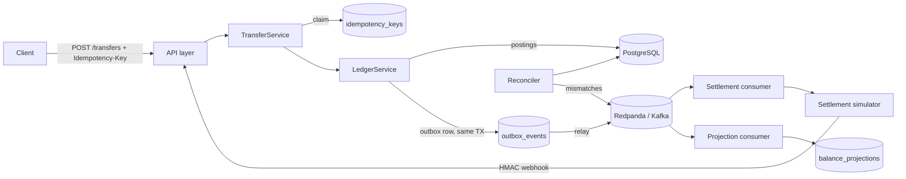

# Architecture

LedgerFlow is a **modular monolith**: one deployable Spring Boot service with
strict package boundaries. Modules interact through the database (transactional
outbox) and Kafka (domain events) — the same seams microservices would use.

## Request flow

## Module responsibilities

| Package | Owns | Must never |
|---|---|---|
| `ledger` | postings, invariant, cached balances | publish events directly |
| `transfer` | idempotency, retries, orchestration | bypass the ledger |
| `outbox` | reliable publishing | hold business logic |
| `projection` | derived read model | be read as truth |
| `settlement` | provider lifecycle, webhooks | mutate ledger rows |
| `reconciliation` | mismatch detection | auto-fix mismatches |
| `fx` | reference rates | invent rates |
| `security` | authN/Z, rate limiting | — |

## Transaction lifecycle

1. `POST /api/v1/transfers` with `Idempotency-Key`.
2. Key claimed (`INSERT`, PK collision = exactly one winner).
3. Ledger TX: validate → 2 postings → balance cache update → outbox row.
   All-or-nothing.
4. Outbox relay publishes `ledger.transaction.posted.v1`.
5. Settlement consumer creates settlement, emits `settlement.requested.v1`.
6. Simulator behaves per scenario; success path calls the signed webhook.
7. Webhook applies settlement idempotently, emits `settlement.completed.v1`.
8. Projection consumer folds postings into the read model.
9. Reconciler (scheduled + on-demand) compares ledger vs settlement state.

## Key design rules

- Postings are append-only; corrections are reversals (ADR-002).
- Balances are projections; postings are truth (ADR-005).
- Delivery is at-least-once; consumers are idempotent (ADR-004).
- Redis never holds authoritative state (ADR-008).
