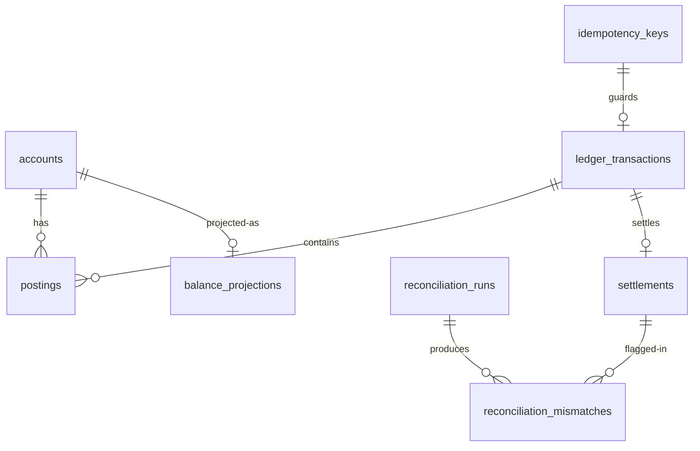

# Data Model

## Entity-relationship overview

## Table guide

| Table | Role | Key decisions |
|---|---|---|
| `accounts` | account master | `version` for optimistic locking; `balance_minor_units` is a cache (ADR-005); `CHECK (balance >= 0)` as defense-in-depth |
| `ledger_transactions` | atomic money movement | immutable once posted; `idempotency_key` unique (nullable); `metadata` jsonb for FX context |
| `postings` | double-entry lines | append-only; `CHECK (amount > 0)`; amount always positive, direction carries sign |
| `idempotency_keys` | retry safety | PK = client key; stores request hash + full response for replay |
| `outbox_events` | reliable publishing | partial index on `(status, next_attempt_at) WHERE PENDING`; `SKIP LOCKED` claim |
| `settlements` | provider lifecycle | `provider_event_id` unique where not null → webhook dedup |
| `reconciliation_runs` / `reconciliation_mismatches` | audit of audits | mismatches never auto-resolved; partial index on open mismatches |
| `balance_projections` | read model | rebuildable; PK = account_id |
| `projection_checkpoints` | consumer offsets | (reserved for manual offset management) |
| `processed_events` | consumer dedup | PK = event id |
| `fx_rates` | reference rates | unique `(provider, base, quote, rate_date)`; NUMERIC for rates (not money) |
| `audit_log` | security audit | append-only |

## Indexing rationale

- `postings(account_id, created_at DESC)` — statement queries are the hottest
  read; the composite index serves them without sorting.
- `postings(transaction_id)` — reversal and transaction-detail lookups.
- `outbox_events` partial index — the relay polls constantly; the partial
  index keeps the poll O(due rows), not O(table).
- `idempotency_keys(expires_at)` — the cleanup job deletes by expiry.
- `reconciliation_mismatches` partial index on open — dashboards query open
  mismatches, not history.

## What the schema deliberately lacks

- No foreign key from `postings` to anything mutable — postings reference
  accounts and transactions immutably.
- No `UPDATE` paths on financial tables in application code; the schema
  doesn't need to forbid what the code never does, but Flyway migrations are
  reviewed with this rule.
